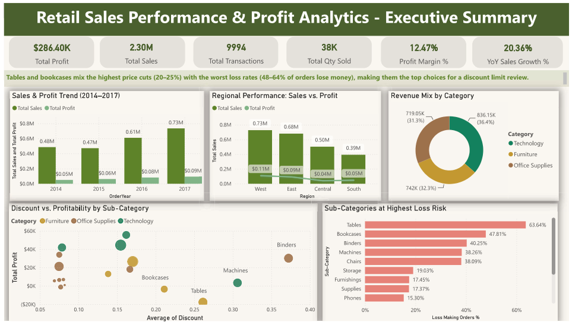
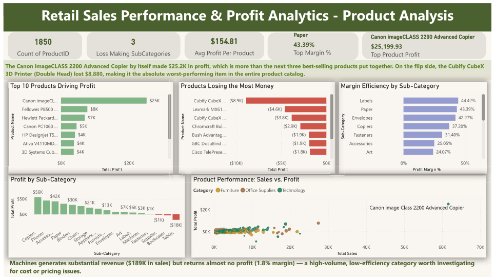
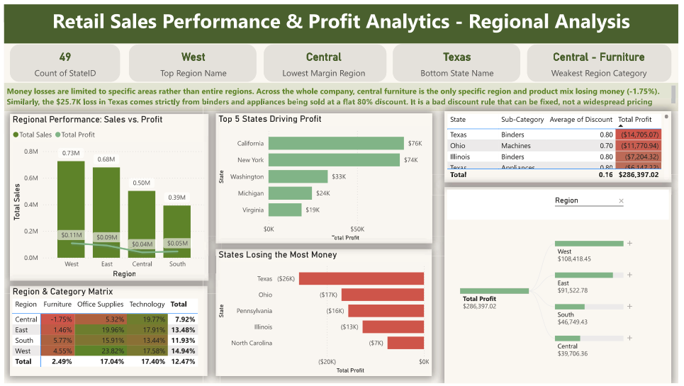
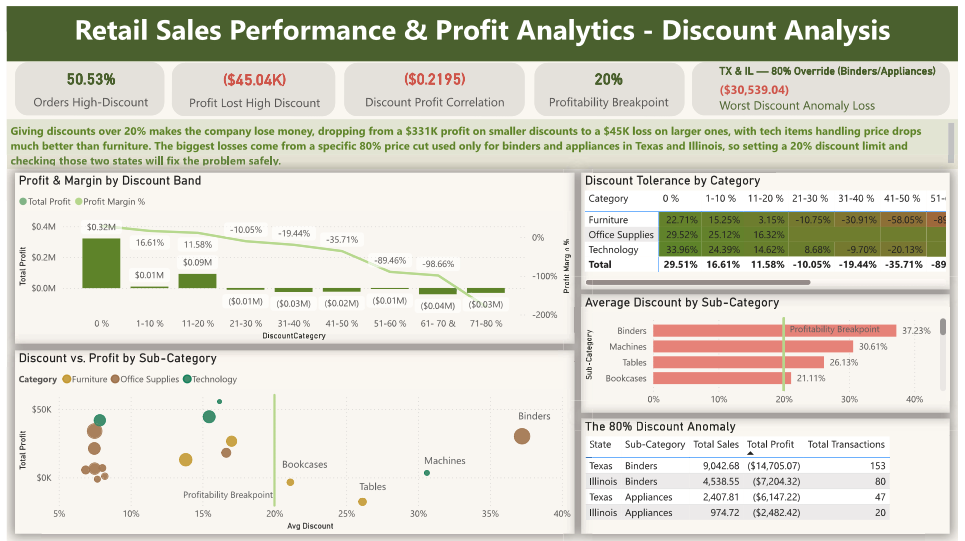
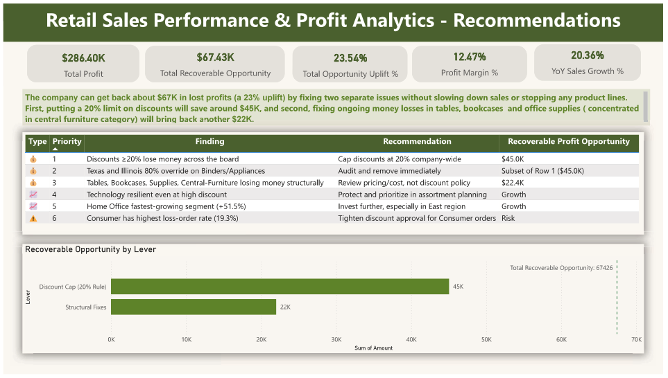
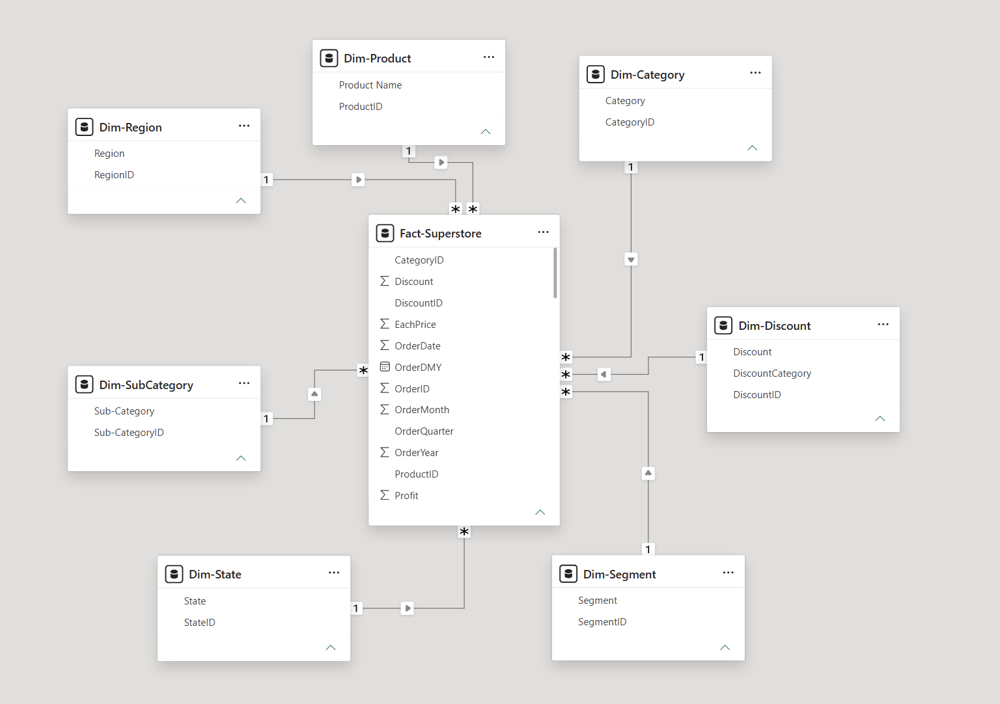

# Retail Sales Performance & Profit Analytics — Power BI Dashboard

A 6-page Power BI analysis of the Superstore dataset (9,994 transactions, 2014–2017), 
covering Executive Summary, Product, Region, Customer Segment, Discount Analysis, 
and Recommendations.

## Key Findings
- Identified a ~$67K recoverable profit opportunity (23% uplift) through discount 
  policy correction and structural pricing fixes
- Found a hard profitability cliff at 20% discount, consistent across all regions and segments
- Isolated an 80% discount override in Texas/Illinois affecting only 2 sub-categories — 
  not a company-wide issue
- Discovered Central-Furniture as the only loss-making Region×Category combination company-wide

## Skills Demonstrated
- **Data Modeling:** Built a star schema (Fact + 5 Dim tables) from a flat source file; 
  diagnosed relationship, cardinality, and floating-point precision issues
- **DAX:** Wrote 25+ measures including ranking logic (ADDCOLUMNS/TOPN), multi-dimension 
  analysis (SUMMARIZE), time intelligence, and a manually built Pearson correlation
- **Analysis:** Multivariate (2–3 variable) analysis to surface findings hidden in 
  single-dimension views; root-cause quantification over surface-level metrics
- **Dashboard Design:** 6-page executive report with conditional formatting, Matrix, 
  Decomposition Tree, and combo visuals matched to each analytical question
- **QA & Debugging:** Cross-validated every figure against source data independently; 
  systematic isolation testing to trace discrepancies to their root cause

## Pages
1. Executive Summary
2. Product Analysis
3. Region Analysis
4. Customer Segment Analysis
5. Discount Analysis
6. Recommendations

## Screenshots

### Executive Summary

### Product Analysis

### Region Analysis

### Customer Segment Analysis

### Discount Analysis

### Recommendations

### Data Model View

## Tools Used
Power BI Desktop, DAX, Power Query

## Download
[Download the .pbix file] (https://github.com/zcthinn/retail-sales-powerbi-dashboard/blob/main/Retail%20Sales%20Performance%20%26%20Profitability%20Analytics%20Project.pbix) to explore interactively.
